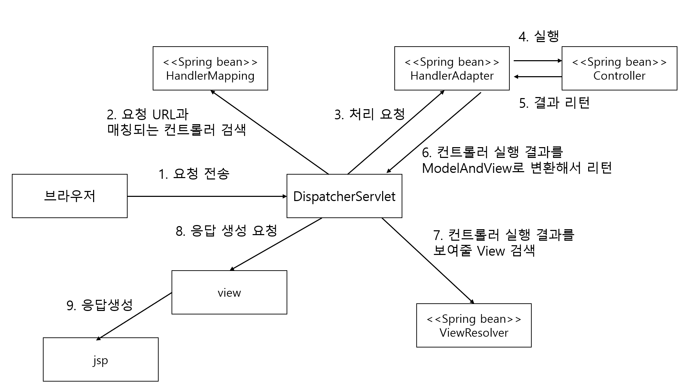

## 스프링 MVC


### 스프링 MVC를 위한 설정

1. spring-mvc.xml

   ```xml-dtd
   <mvc:annotation-driven/>
   
   <mvc:default-servlet-handler/>
   
   <mvc:view-resolvers>
   	<mvc:jsp prefix="/WEB-INF/view" />
   </mvc:view-resolvers>
   ```

   1. 애노테이션을 이용하기 위한 설정
   2. DispatcherServlet의 매핑 경로를 "/"로 주었을 떄 JSP/HTML:/CSS 올바르게 처리
   3. JSP를 이용하여 실행결과를 보여주기 위한 설정


### 참고 : 실제 운영 설정

```xml
<annotation-driven /> <!-- 1. 애노테이션 설정-->

<beans:bean class="org.springframework.web.servlet.view.InternalResourceViewResolver">
    <beans:property name="prefix" value="/WEB-INF/views/" />
    <beans:property name="suffix" value=".jsp" />
</beans:bean> <!-- 3. JSP 실행결과를 위한 설정
```

- [deafult-servlet-handler의 필요성]([https://cnpnote.tistory.com/entry/SPRING-mvc-default-servlet-handler-%EC%9D%98-%ED%95%84%EC%9A%94%EC%84%B1%EA%B3%BC-%EC%82%AC%EC%9A%A9%EB%B2%95%EC%9D%80-%EB%AC%B4%EC%97%87%EC%9E%85%EB%8B%88%EA%B9%8C](https://cnpnote.tistory.com/entry/SPRING-mvc-default-servlet-handler-의-필요성과-사용법은-무엇입니까))
  - DispatcherServlet은 매핑 "/*"을 사용하여구성하기 때문에 .js , .css 요청도 DispatcherServlet에 매핑됨
  - RequestMapping에 등록되지 않은 낮은 속성의 자원은 DefaultServletHandler에게 요청함
    - @RequestMapping("juqery.js") 요청 후 못찾으면 폴더 웹에서 리소스를 가져옴


### 스프링 MVC 핵심 구성 요소



- Dispatcher에 HandlerMapping이 빈 객체를 전달
- DispatcherServlet은 다음과 같은 이슈를 처리하기 위한 구현
  - 스프링 2.5까지 사용된 Controller 인터페이스
  - 특수목적으로 사용되는 HttpRequestHandler 인터페이스를 구현한 클래스
- 이런 문제를 동일하게 처리하기 위한 것이 바로 HandlerAdapter Bean이다


### 컨트롤러와 핸들러

- 컨트롤러를 찾아주는 객체타입은 ControllerMapping이 아닌 이유?

  - 자신이 직접 만든 클래스를 이용하여 클라이언트를 요청을 처리할 수도 있음

  - 처리하는 객체 타입은 꼭 @Controller가 아니며 HttpRequestHandler도 존재한다

    