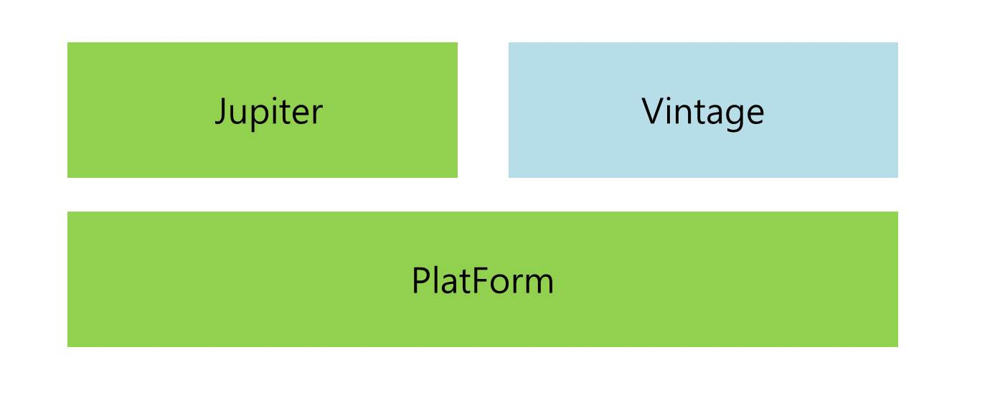

# 테스트하는 다양한 방법

- [강좌 : 더 자바, 애플리케이션을 테스트하는 다양한 방법](https://www.inflearn.com/course/the-java-application-test)


## JUnit5



- Jupiter : Test Engine API 구현체 Junit5를   제공
- Vintage : Junit 4와 3를 지원하는 TestEngine 구현체
- Test 클래스 생성 단축키 : 클래스에서 ctrl + shift + T
- JUnit5부터는 public이 아니여도 상관없음
- 실행 단축키 
  - 윈도우 : ctrl + shift + F10
  - Mac O/S : ctrl + shift + R


## 기본 애노테이션

- @Test
- @BeforeAll / @AfterAll
  - 테스트 실행 전/ 실행 후 단 한 번만 작동한다
  - 반드시 static void으로 선언해야한다
- @BeforeEach / @AfterEach
  - 모든 테스트 실행할 때 각각 테스트 이전과 이후에 실행한다
- @Disabled
  - 테스트에서 실행하기 싫을 때 애노테이션으로 표기


## JUnit5 테스트 이름 표시하기

- @DisplayNameGeneration(DisplayNameGenerator.ReplaceUnderscores.class)
  - 언더스코어를 제거한 공백으로 바꾼 메소드 이름 표시
- @DisplayName
  - 테스트 이름을 따로 표기하고 싶을 때 사용

## Assertion

- org.junit.jupiter.api.Assertions

| 메소드명                               | 내용                                  |
| -------------------------------------- | ------------------------------------- |
| assertEquals(Expected, actual)         | 실제값과 기대값이 같은지 확인         |
| assertNotNull(actual)                  | 값이 Null 아닌지 확인                 |
| assertTrue(boolean)                    | 다음 조건이 참인지 확인               |
| assertAll(executables...)              | 모든 확인 구문 확인                   |
| assertThrows(expectedType, executable) | 예외 발생 확인                        |
| assertTimeout(duration, executable)    | 특정 시간 안에 실행이 완료되는지 확인 |

- assertAll 
  - 여러 개의 assert구문을 람다식으로 묶어버리면 개별적으로 실행하지 않아도 된다
- assertThrows(NoSuchElementException.class, 람다); 형태로 작성


## 조건에 따라 테스트 실행

- 특정한 OS, 특정한 자바버전, 환경변수에 따라 실행 여부를 결정할 수 있음
  - assumeTrue() : 조건에 맞으면 아래 테스트 코드 실행
  - assumingThat() : 조건에 맞으면 안에 작성된 코드가 실행
- @Enabled와 @Disabled
  - OnOs : 운영체제 입력
  - OnJre : 특정 자바 버전
  - IfSystemProperty :
  - IfEnvironmentVariable : 환경변수 매칭 값
  - If


## Mockito

- Mock: 진짜 객체와 비슷하게 동작하지만 프로그래머가 그 객체의 행동을 관리하는 객체
- 이미 구현된 클래스에 대해 mock할 필요는 없다. 하지만 외부 서비스같이 분리되어있는 건 mocking하는 걸 추천
- 스프링 부트 2.2+ 프로젝트 생성 시 spring-boot-starter-test에서 자동으로  mockito를 추가해줌
- 다음 세 가지만 알면 테스트를 쉽게 작성할 수 있음
  - Mock을 만드는 방법
    - Mock이 어떻게 동작하는지 관리하는 방법
  - Mock의 행동을 검증하는 방법

###  Mock 객체 만들기

- Mockito.mock() : 메소드로 만드는 법
  - MemberService memberService = mock(MemberService.class)
- Mock 애노테이션으로 만들기
  - Junit 5 extension으로 MockitoExtension을 사용
  - 필드
  - 메소드 매개변수

```java
@ExtendWith(MockitoExtension.calss)
class StudyServiceTest {
	
	@Mock 
	MemberService memberService;
	
	@Mock
	StudyRepository studyRepository;
	
}
```


```java
@ExtendWith(MockitoExtension.class)
class StudyServiceTest{
	
	@Test
	void createStudyService(@Mock MemberService memberService, @Mock StudyService studyService){
		
		StudyService studyService = new StudyService(memberService, studyRepository);
		assertNotNull(studyService);
	}
	

}
```